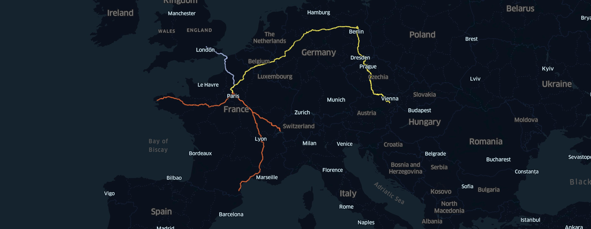

# 🚅 TrainMap - trainmap.ntag.fr
Get GeoJSON train itineraries between stations, based on raildar web service (based on osrm engine).
You can import this GeoJSON in https://kepler.gl/demo for example to vizualise it.



## Usage

- https://trainmap.ntag.fr
- `GET https://trainmap.ntag.fr/api/route?dep=4916&arr=8267` // Trainline stations IDs
- `GET https://trainmap.ntag.fr/api/route?dep=48,2&arr=52,13` // lat,lng coordinates

## Development
### Installation
```
npm install

cd front/
npm install
```

### Usage
```
node .

# Then in another shell
cd front/
npm start
```

- Open http://localhost:3000 for the web interface
- `GET http://localhost:5001/api/route?dep=4916&arr=8267`
- `GET http://localhost:5001/api/route?dep=48,2&arr=52,13`

## Acknowledgment
Routing from http://raildar.fr/osrm-engine/ 🙌
